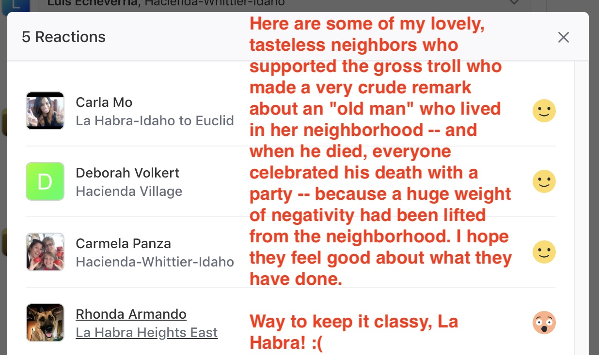
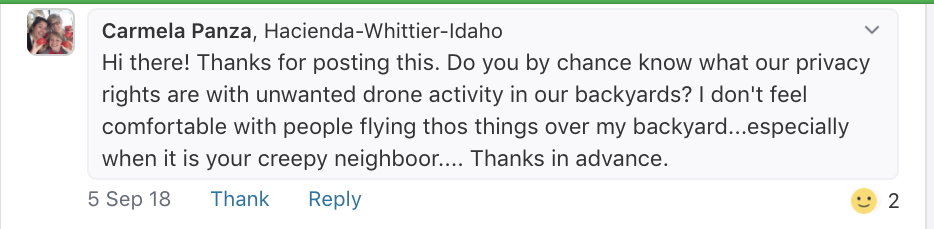
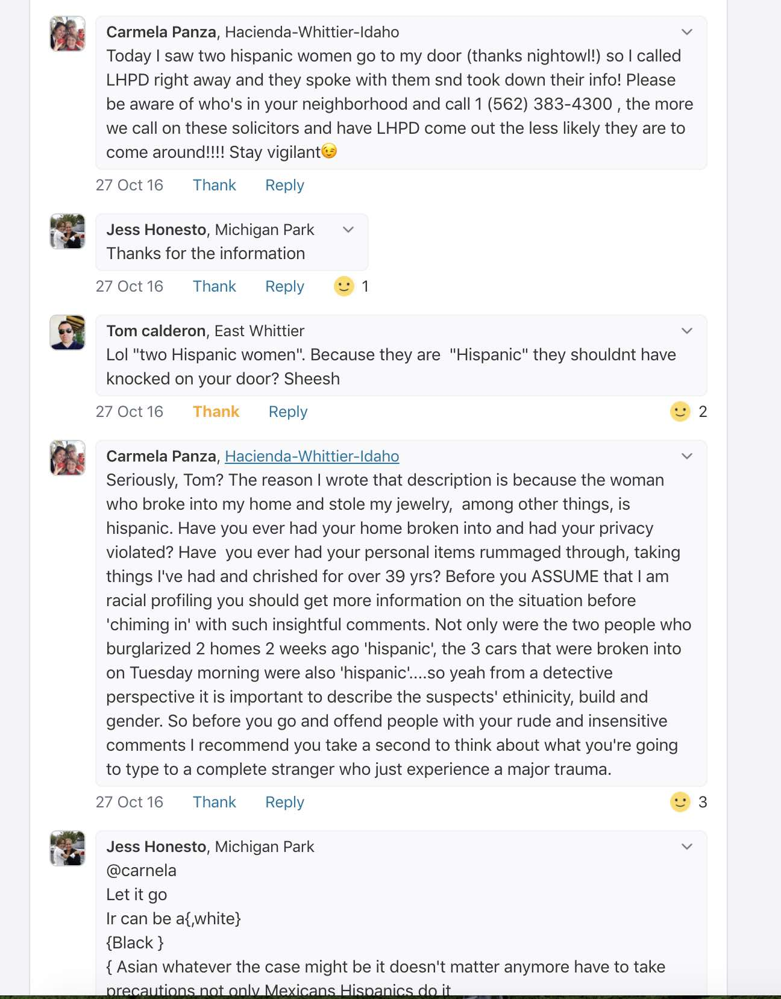

May 22, 2020

On May 19, 2020, my next-door neighbor decided to air a years-long feud with me behind my back on the <a href="https://nextdoor.com/" target="_blank">Nextdoor</a> internet forum, where several trolls and death-wishers piled on with aggressive comments, until Nextdoor finally removed the entire thread. 

**I denounce, in the strongest possible terms, my neighbor's passive-aggressive actions, including her repeated attempts over the years at defaming me, online, and offline, and her most recent, blatant attempt (screenshots below) to turn my own neighborhood against me in an online witch hunt. I also denounce, in the strongest possible terms, her negative characterizations of me, that she has spread around my immediate neighborhood, and my entire community.**

Below are some of the toxic examples of the nasty, smelly, rotten garbage that people decided to spew at me that evening.

It is amazing that these neighbors, some of whom are supposed "respected" professionals in their careers, think that it is completely acceptable to go behind someone's back to defame them, then gather other random internet trolls to attack them and single them out, and then have the nerve to sit back and completely enjoy the trash fire that they helped to create.

**Absolute crap.**

Everyone involved in this mess should be completely ashamed of how they have behaved. I pray that they do not have families, although I know that some of them do, because it is sad and pathetic how people like this tend to pass on their poison, and their judgments, right on to their own kids, ruining their lives, and the lives of other people.

I'm completely disgusted by all of this, and I hope all of these passive-aggressive people in my community get actual, professional help with their anger issues, so that we can go back to some level of peace and respect that seems to have completely disappeared.

**Trigger warning.**

<strong style="color:red !important">None of this fucking trash is worth reading anyway.</strong>

 

 

 

 

 

 

 

 

