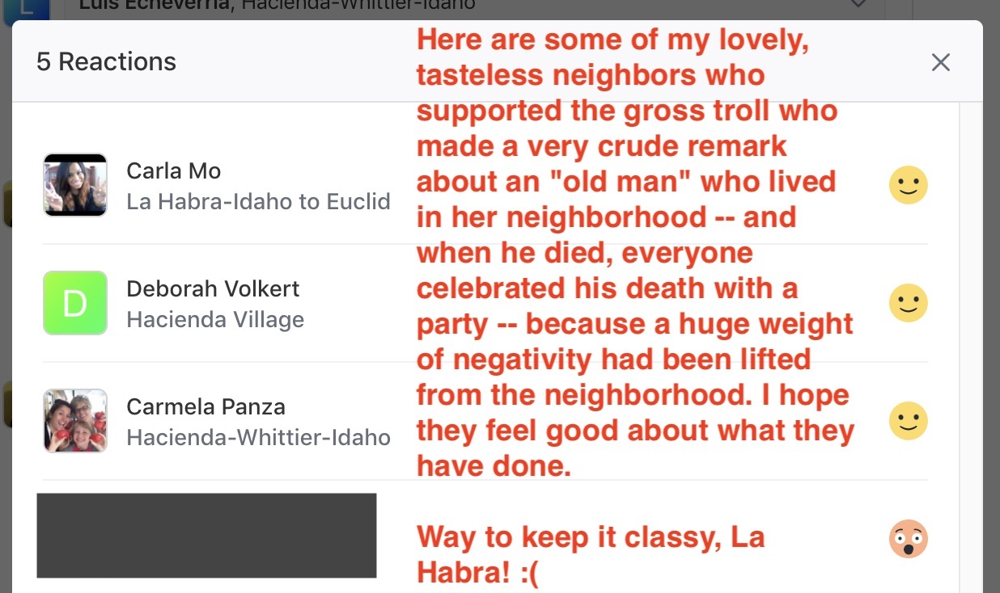

May 22, 2020

On May 19, 2020, my next-door neighbor decided to air a years-long feud with me behind my back on the <a href="https://nextdoor.com/" target="_blank">Nextdoor</a> internet forum, where several internet trolls and death-wishers piled on with aggressive comments, until Nextdoor finally removed the entire thread. 

I am not sure if the thread will come back.

**I denounce, in the strongest possible terms, my neighbor's passive-aggressive actions, including her repeated attempts over the years at defaming me, online, and offline, and her most recent, blatant attempt (screenshots below) to turn my own neighborhood against me. I also denounce, in the strongest possible terms, her negative characterizations of me, that she has spread around my immediate neighborhood, and my entire community.**

Here are some of the screenshots, and some toxic examples of the nasty, smelly, garbage that people decided to spew at me that evening.

It is amazing that these neighbors, some of whom are supposed "respected" professionals in their careers, think that it is completely acceptable to go behind someone's back to defame them, and to gather other random internet trolls to attack them and single them out, and then sitting back, watching and encouraging more attacks and veiled threats.

**Absolute, rank, crap.**

I hope everyone involved in this mess is completely ashamed of how they have behaved. I pray that you do not have families, although I know that some of you do. It's sad how people like this tend to pass on their poison, and their judgments, right on to their own kids, ruining their lives, and the lives of other people.

I'm completely disgusted by all of this, and I hope all of these passive-aggressive people in my community get actual, professional help with their anger issues, so that we can go back to some level of peace and respect that seems to have completely disappeared.

**Trigger warning. None of this trash is worth reading anyway.**

 

 

 

 

 

 

 

 

<!-- church-going -->

