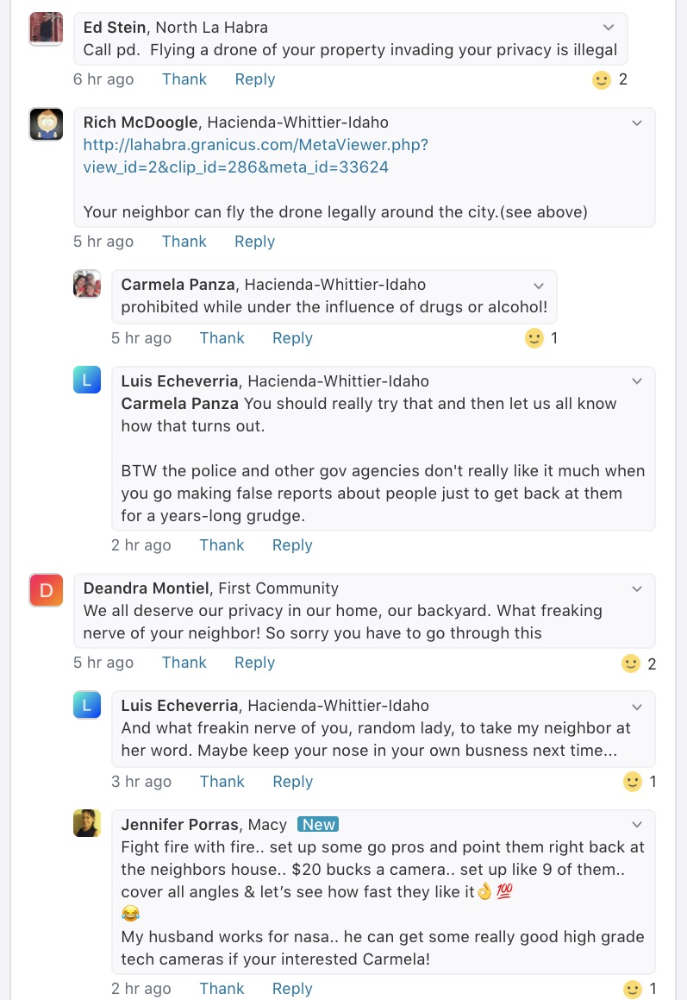
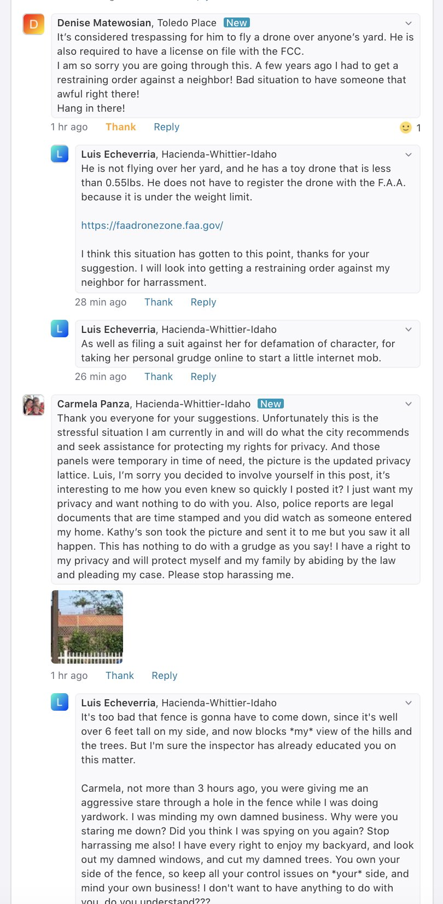

May 22, 2020

On May 19, 2020, my next-door neighbor decided to air a years-long feud between the both of us on the <a href="https://nextdoor.com/" target="_blank">Nextdoor</a> internet forum, where several internet trolls and death-wishers piled on with aggressive comments, until Nextdoor finally removed the entire thread. 

I am not sure if the thread will come back.

Whether the thread comes back or not, I do know one thing for sure: **I denounce -- in the strongest terms -- how my next-door neighbor decided to deal with this. I also denounce -- in the strongest terms -- her negative characterizations of me, that she has spread around my immediate neighborhood, online and off.**

Here are some of the screenshots, and some toxic examples of disgusting crap that people decided to spew at me that evening.

It is amazing that these people -- some of whom are supposed "respected" professionals in their careers -- think that it is acceptable to go behind someone's back to defame them, online and offline, and to gather other random internet trolls in order to attack them, and then support the people doing the attacks.

I'm completely disgusted by all of this, and I hope all of these passive-aggressive people in my community get actual, professional help with their anger issues, so that we can go back to some level of peace and respect that seems to have completely disappeared.

 

 

 

 

 

<!-- church-going -->

