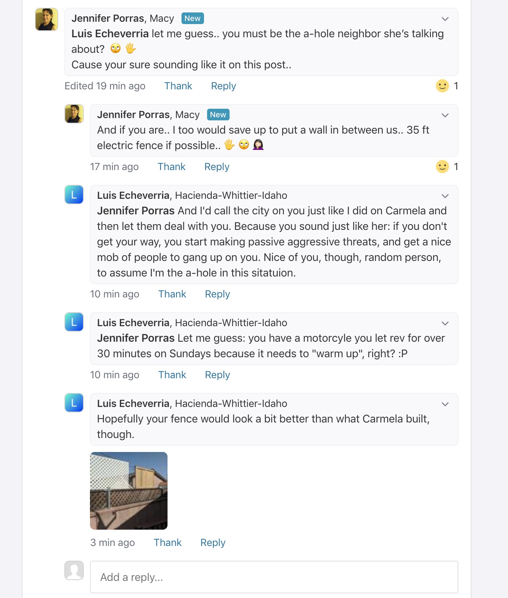
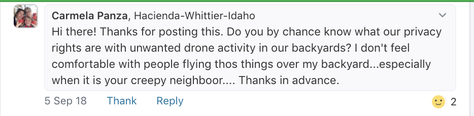
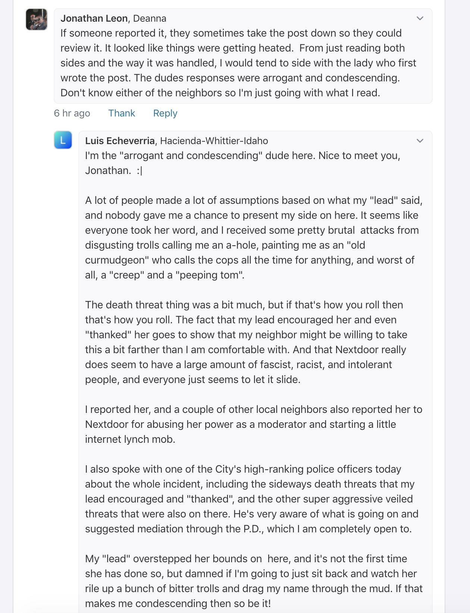

Luis A. Echeverria 

May 22, 2020

On May 19, 2020, my next-door neighbor decided to air a years-long feud between us on the <a href="https://nextdoor.com/" target="_blank">Nextdoor</a> internet forum in the "Crime and Safety" category, where several trolls and death-wishers piled on with aggressive comments after I tried to defend myself. Nextdoor finally removed the entire thread after a couple of neighbors and I complained to site administrators. But by then, the post had been seen in 28 neighborhoods, and had been up for almost a full 24 hours.

I'm not sure if the posts will stay down, because Nextdoor doesn't write me back at all.

**I denounce, in the strongest possible terms, my neighbor's passive-aggressive actions, including her repeated attempts over the years at defaming me, online, and offline, and her most recent, blatant attempt (screenshots below) to turn my own neighborhood against me in an online witch hunt. I also denounce, in the strongest possible terms, the negative characterizations of me that she has spread around my community and on Nextdoor. They are completely false.**

Below are some of the toxic examples of the nasty, smelly, rotten garbage that people decided to spew at me that evening.

It is amazing to me how these neighbors, some of whom are supposedly "respected" professionals in their careers, think that it is completely acceptable to go behind someone's back to defame them, and then have the nerve to sit back and encourage other people to join in, even after people bring up death and violence.

**It's total crap.**

Everyone involved in this mess should be completely ashamed of how they have behaved. I pray that they do not have families, although I know that some of them do, because it is sad and pathetic how people like this tend to pass on their poison, and their judgments, right on to their own kids, ruining their lives, and the lives of other people.

I hope all of these passive-aggressive, bitter people in my community get actual, professional help with their anger issues, so that we can go back to some level of peace and respect that seems to have completely disappeared.

**Trigger warning.**

<strong style="color:red !important">None of this fucking trash is worth reading anyway.</strong>

 

 

 

 

 

 

 

 

