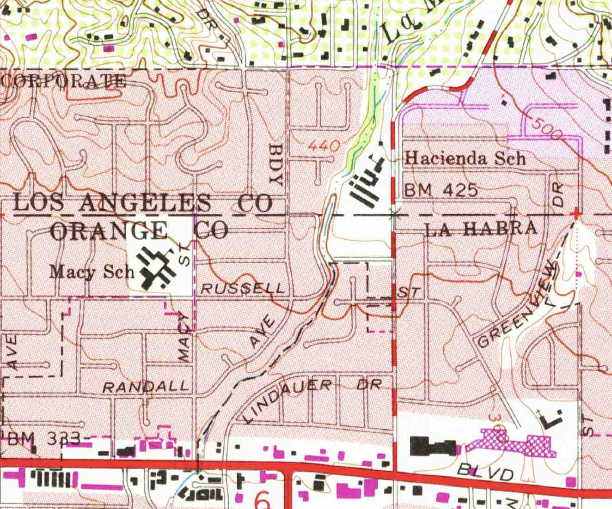
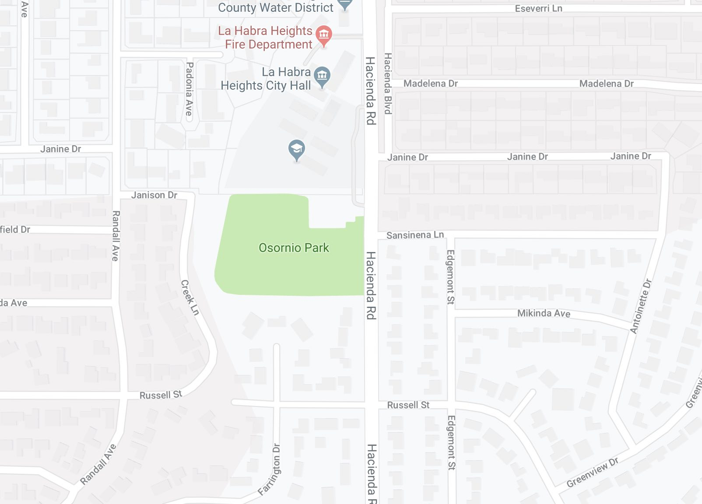
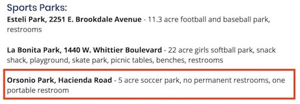
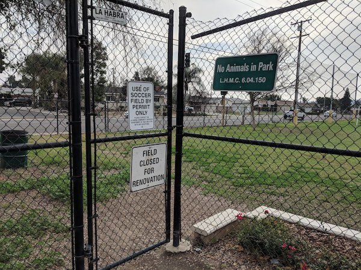
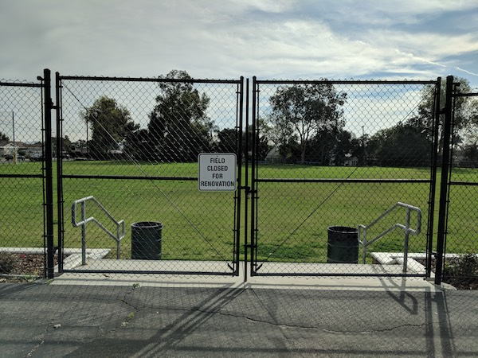
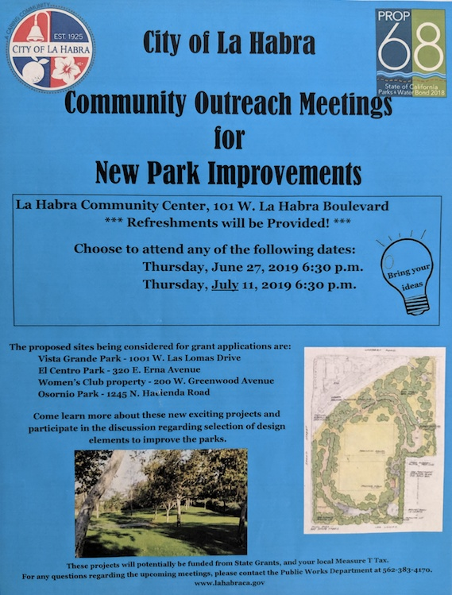

A look at what's been going on at Osornio Park over the last 10 years

Luis A. Echeverria 
July 14, 2019

I live in north La Habra, about 3 blocks away from Osornio Park. When I moved here 10 years ago, the park looked mostly like it did in the 70s and 80s, when it was the playground and sports field for Hacienda School. I attended Hacienda until third grade. After my third grade year, the school was closed and I ended up going to Jordan School in Whittier, but that's another story.

  <figure>
    
    <figcaption>
      Old-school topo map of the area around Osornio Park
    </figcaption>
  </figure>

Around 2009-2010, neighbors would go to the park to hang out, meet, sit under trees, walk around the perimiter of the park (there was a "walking trail" with instructions on how to stretch and how far you have walked, etc. -- there were people who used this daily). There were no "no animals in park" or "use of soccer field by permit only" signs. And people did take their dogs there, because it's the only open field in the area, besides La Bonita Park, but that park has had "no animals in park" signs for as long as I can remember.

People from all ages would gather at Osornio Park. Moms with their kids, adults, older people. I enjoyed going there a lot.

  <figure>
    
    <figcaption>
      <a href="https://www.google.com/maps/@33.9454476,-117.9660326,17z" target="_blank">
  Google Maps</a> screenshot of Osornio Park and surrounding neighborhood
    </figcaption>
  </figure>

Shortly after that, the Pumas soccer team started having practices and games there, and within a couple of years, the old trees were all removed, and the park was graded flat. Soccer turf was installed, and manure was laid so that you could smell it at my house, and I'm 3 blocks away. I do not remember getting any notices from the City, and I was definitely not asked for any feedback on how this space would be used. I don't know anyone else in my neighborhood who received a notice or felt like they had a say in this either.

The practices would sometimes be at night, so the City brought out portable lights, the kind used for construction work, every time they had a night practice. The lights would be really bright, and would shine right at the front of the houses on the east side of Hacienda Road.

A fence was installed around the perimiter with locking gates, and "no animals in park" and "use of soccer field by permit only" signs went up.

But the neighbors mostly continued to meet there, although now the mood was completely different, and a bit uncomfortable.

### It was nice while it lasted

One day, around 2010, I was there with a neighbor and our dogs. We were there before the soccer team got there. As we saw that a practice was starting, we leashed up our dogs, and started to head out.

At that point, two men, one who I now know is the head of the Pumas soccer team, approached us, and told us that we should be aware that the City will start ticketing people who bring dogs to the park. He then started complaining about dog feces, at which point we both showed him our bags, and I mentioned that I even pick up other people's dog waste so that we don't get a bad name.

After that, I was really disgusted, that this person that had nothing to do with the City was basically threatening the City on us. I wasn't the only one, and since that time, I've talked to several people who have been approached and "talked to" by people not with the City about what we were doing at Osornio Park.

And the neighbor I was with -- I haven't seen him back at the park since that time.

Around the same time, one of my neighbors started telling me that the park was locked in the early mornings when she was trying to take her dog there. She really gets a lot out of walking and playing with her dog, and I know it helps her a lot. She was so infuriated that she started calling the City asking if she could have a key so that she could use the park. The City's response was that they don't give out keys to parks. This went on for several years. The City would put signs up saying "field closed for renovation", and someone would lock the park. But then, someone would let the team in to practice, and then they'd lock it back up when they were done, so we would complain again. We as residents saw this and were shaking our heads. I never got a straight answer about who had a key, but the official word from the City was "we don't give out keys to our parks".

  <figure>
    
    <figcaption>
      Screenshot of <a href="https://www.google.com/maps/@33.9454476,-117.9660326,17z" target="_blank">City website</a> with description of Osornio Park
    </figcaption>
  </figure>

It was around that time I started writing emails and calling the La Habra Recreation Department. I used the City's online complaint system and brought up all of these issues. I wanted to know why the residents weren't taken into account when redesigning Osornio Park, but I would get answers like "well, there is a picnic bench there", even though it is old, and in bad shape, and it sits next to a water pump house that can be very noisy. I asked why all the trees were removed, and I was told they planted new ones. I asked why this team had a key, and I was told they were not supposed to have a key.

I was also sent a copy of the affiliate agreement that teams must sign, which stated among other things, that the teams must provide portable bathrooms and not park on the premises. I haven't seen a portable toilet there in quite a while, and the team used the basketball courts for parking frequently.

A couple of years after that, advertising banners were hung on the fences, having nothing to do with soccer, or the City, or anything. They were ads. As if I am not bombarded by ads enough already. I'd like to go to my local park and not see more.

At that point, I kind of gave up, but it left such a bad taste in my mouth. The only exit from my neighborhood that has a signal off of Hacienda Road is Sansinena Road, which dead-ends at the park. I would wait at that light and read all of those signs, and wonder how this soccer team got so much power.

### Present Day: Has anything changed?

Fast forward to January 2019, and just like clockwork, the "field closed for renovation" signs went up. But this time, there was no renovation going on. One day, I saw there was a man inside playing with his dog, but all the gates were closed. As I got closer, I noticed the larger gates on the west side of the basketball courts were not locked, so I went inside to talk to the man, who turned out to be my neighbor.

  <figure>
    
    <figcaption>
      Main entrance to Osornio Park
    </figcaption>
  </figure>

We started talking, about how this kept going on, and how the soccer team was playing games even as the signs were up, but still they were telling people not to come in with dogs, and then locking the park (or making it look like the park was locked shut). He called the City manager right there and asked what the "maintenance" was that was going on, because this park was closed for a couple of weeks and there was absolutely no maintenance going on, and we were standing right on the turf.

  <figure>
    
    <figcaption>
      Front gates of Osornio Park
    </figcaption>
  </figure>

I thought that at that point, someone at the City would listen, but then a couple of weeks later, I was there again during the day, and again, the front gates were locked, but the gates on the west side of the basketball courts were unlocked, but closed. I noticed there was a woman inside, playing with her dogs, and I recognised her as I got closer -- I had seen her before and had talked to her at the park several times.

She didn't see me at first, but then she turned around and noticed me, and the first thing she said was "are you here to kick me out of the park"? We then started talking about when this was going to end. She was a frequent visitor, mostly coming in the early mornings when nobody would be there.

On my way out of the park, a man was sitting at the bench near the entrance (the one next to the loud water pump), and he asked me what was going on. I told him that the park isn't closed, and that he could go right in, but he had to use the back gates. He thanked me and went inside to eat his lunch.

That was when I called the City manager's office myself, and sent a really long email explaining all of these issues, and wanting to know what could be done to shine a light on this. I was told the park would not be locked anymore, but the very next day, all the gates were closed again, but this time, no locks. So I called the City again to try to find out if they knew who kept closing the front gate? **With the "no maintenance" signs, and a closed gate, it looks closed from the street**.

Very quickly, the front gates were locked **open**. So that nobody could lock the park. I'm not sure if that's a good solution, but I do appreciate the City doing something in the moment.

After that, I was invited to come in and speak with Mayor Gomez about all of this, and I explained everything that I have talked about here.

Shortly after that, I sent in some pictures to the City showing that the soccer team parents were using the basketball courts as a parking lot, and I asked why there are still no bathrooms, even though from my understanding, the team is required to provide them.

### Some light at the end of the tunnel

A couple of weeks ago, I was really excited to see flyers from the City asking for input on our local parks, and how Prop 68 park funds could be used for improvements.

  <figure>
    
    <figcaption>
      Propostion 68 Flyer from the City of La Habra, asking for feedback
    </figcaption>
  </figure>

I was not surprised to see the same man who "talked to us" years ago there at that meeting on July 11th at the community center. The head of the soccer team. He was there, lobbying for his team. I waited for him to finish, and I spoke with several people from the City at this meeting about all of these issues.

I hope that the City will make Osornio Park a more welcoming park for everyone, not just people who play sports.

Please take the residents into account, City of La Habra, and **please don't put residents in the position of being intimidated by parents and owners of organized sports teams**.

